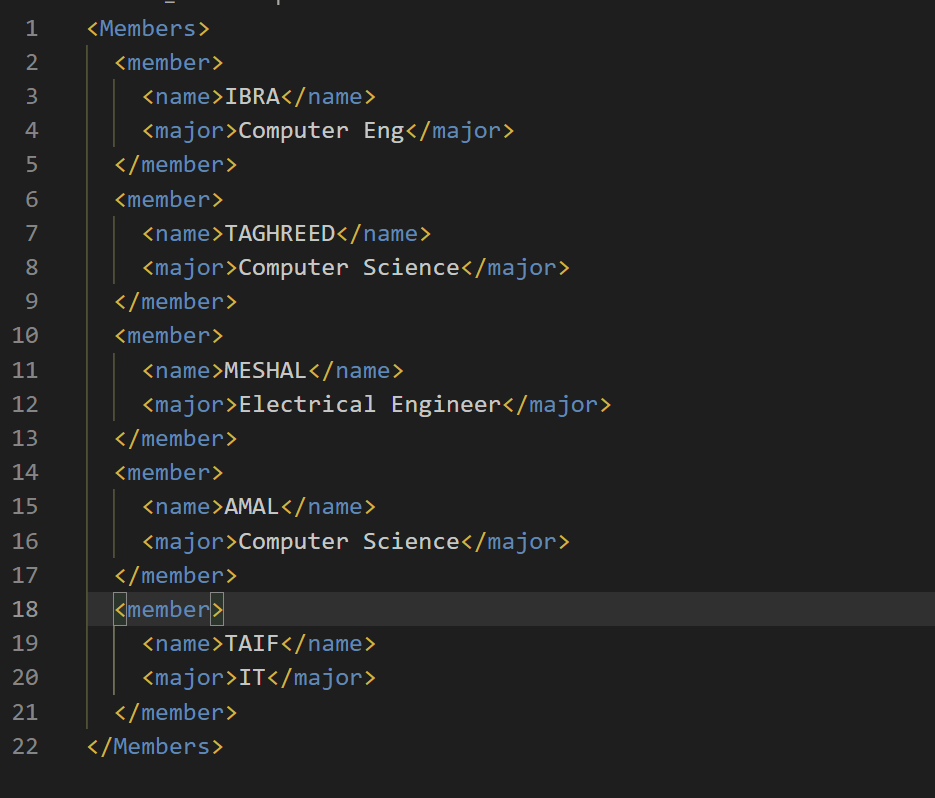
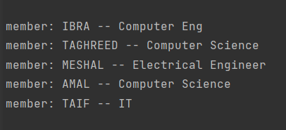

  

  
  
----

# Project05
Xml-Project

# Project Requirements :

 - Write xml file. 
 - Read xml file. 
 - Use thread for each operation.  
 - Make your code clean 
 - Use GitHub to work as a team.

>output in VS Code

>output

# Team members :
* Ibrahim Alobaysi  
* Meshel Najdi  
* Taif Bin Eid  
* Amal Almutiri  
* Taghreed Alqahtani 

